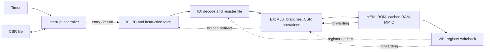

# 32bitrisc — Five-Stage RISC-V Processor

A SystemVerilog processor project targeting the **Digilent Arty S7-25 FPGA**, developed to explore CPU architecture, pipeline control, memory systems, bare-metal firmware, and hardware verification.

The project combines a five-stage RV32I processor with memory-mapped peripherals, a direct-mapped data cache, machine-mode CSR operations, and timer interrupts. Supporting software includes C drivers, assembly context-switch routines, a custom Python assembler, and simulation-log tools.

> This README describes the updated `cpu_top.sv` supplied during development. The repository must contain its matching decoder, pipeline registers, fetch stage, memory modules, and type package. Older source revisions use different interfaces.

## Highlights

- **Five-stage pipeline:** instruction fetch, decode, execute, memory, and writeback.
- **Forwarding and hazard control:** MEM/WB operand forwarding, load-use stalls, pipeline flushing, and branch/jump redirection.
- **Memory system:** separate instruction and data paths, data-side program-ROM access, and a direct-mapped data cache for RAM accesses.
- **Memory-mapped I/O:** switches, LEDs, UART, and timer registers.
- **Machine-mode support:** CSR read/modify/write operations, interrupt entry, saved return PC, and `mret` handling.
- **Bare-metal software:** GCC-based C firmware, peripheral drivers, startup assembly, and experimental round-robin scheduling.
- **Verification:** directed SystemVerilog testbenches with assertions, simulation waveforms, and Python register-log inspection.
- **FPGA development:** Vivado synthesis, implementation, static timing analysis, and utilization/power report exploration.

## Architecture



### Pipeline control

The forwarding unit selects operands from the MEM or WB stage, with MEM forwarding taking priority. Forwarding also supplies store data and register-based CSR operands.

A load-use dependency stalls fetch/decode and inserts a bubble into the execute stage. Branches, jumps, interrupt entry, and interrupt return participate in pipeline redirection and flushing.

UART transmit stores hold the pipeline while the transmitter is busy. The global enable input can also stall pipeline progress.

### Memory and caches

The updated CPU top separates program ROM, data RAM, and peripheral accesses. A second ROM read interface supports data loads from program memory, including constants.

The data cache is connected between data RAM and the load-result path. Only RAM addresses are cacheable; ROM and MMIO use separate return paths. Byte, halfword, and word load formatting is supported, including signed and unsigned byte/halfword loads.

The cache modules inspected in this project use **16 direct-mapped entries with one 32-bit word per entry**, giving 64 bytes of data storage per cache, excluding metadata:

- Address bits `[5:2]` select the entry.
- Address bits `[31:6]` provide the tag.
- Valid bits are cleared on reset.
- Load misses fill data-cache entries from RAM.
- Store hits update the cached word or selected byte/halfword, while the CPU also writes backing RAM.
- Store misses do not allocate entries in the inspected data-cache implementation.

An instruction-cache module is also included in `Icache.sv`. Its integration is within the fetch hierarchy and should be checked against the matching `if_stage.sv`; the updated CPU top alone does not establish that connection. These simple cache modules do not implement dirty-line writeback or an external-memory refill protocol.

## Memory map

The updated CPU top decodes the following regions:

| Address range | Region |
| --- | --- |
| `0x00000000–0x00000FFF` | Program ROM, 4 KiB window |
| `0x00001000–0x00004FFF` | Data RAM, 16 KiB window |
| `0x80000000` and above | Memory-mapped peripherals |

The backing memory modules must implement these windows consistently with `software/link.ld`.

### Peripheral registers

| Address | Register | Access / behavior |
| --- | --- | --- |
| `0x80000000` | GPIO switches | Read low four bits |
| `0x80000004` | GPIO LEDs | Read/write low four bits |
| `0x80000008` | UART status | Read: bit 0 = TX busy, bit 1 = RX ready |
| `0x8000000C` | UART data | Read received byte; write transmit byte |
| `0x80000010` | Timer count | Read free-running counter |
| `0x80000014` | Timer compare | Read/write compare value |
| `0x80000018` | Timer interrupt enable | Read/write bit 0 |
| `0x8000001C` | Timer interrupt status/clear | Read pending status; write bit 0 to clear |

Reading UART data clears the receive-ready flag. UART stores use the low eight bits of the write data.

## CSRs and interrupts

CSR execution supports register and immediate forms of read/write, set, and clear operations. The old CSR value is routed into the normal pipeline result path for destination-register writeback.

The CSR file provides the machine-mode state used by the interrupt path:

- `mstatus`: interrupt-enable state, including MIE and MPIE.
- `mtvec`: interrupt entry address.
- `mepc`: saved execution address for interrupt return.

The timer feeds the interrupt controller. Interrupt acceptance is gated by pipeline conditions, including global stalls, load-use hazards, branch redirection, an executing CSR instruction, and a valid decode-stage instruction. On entry, the CSR file receives the interrupted PC and fetch redirects to the handler. An `mret` instruction requests return through `mepc`.

This is a limited machine-mode implementation, not a claim of complete privileged-architecture or exception compliance.

## Firmware

The `software/` directory contains:

- **C drivers** for GPIO, UART, timer, and interrupt control.
- **Startup assembly and linker script** for a bare-metal application.
- **Trap-entry assembly** that saves and restores execution context.
- **Thread metadata and a round-robin scheduler** for an experimental two-task runtime.
- **Python instruction-generation tools** and binary-to-hex conversion.

The context-switch routine saves general-purpose registers on the current stack, records the stack pointer and `mepc`, calls the C handler, and restores the selected task's context before `mret`.

The committed software example remains experimental: first-task launch and periodic timer rearming need to be checked against the working firmware revision. In the previously inspected example, the first interrupt could replace thread 0's initial context with `main()`'s context, and the handler cleared the timer interrupt without advancing the compare register.

## FPGA demonstration

Project development has included **terminal Snake over UART on FPGA**, exercising instruction execution, memory access, and serial peripheral communication. Timer-interrupt and task-switching demonstrations have also been run during development; reproducing them requires the matching hardware and firmware revisions.

The checked-in software should be treated as development material rather than a packaged release of every demonstration.

## Repository layout

```text
32bitrisc.xpr                          Vivado project
32bitrisc.srcs/
  sources_1/new/
    cpu_types_pkg.sv                   Shared types and operation definitions
    cpu_top.sv                         Pipeline and peripheral integration
    top_fpga.sv                        Board wrapper
    if_stage.sv                       Fetch and program-ROM interface
    instr_decoder.sv                  Instruction decode
    ALU.sv / regfiles.sv               ALU and register file
    id_ex_reg.sv                      ID/EX pipeline register
    ex_mem_reg.sv                     EX/MEM pipeline register
    mem_wb_reg.sv                     MEM/WB pipeline register
    imem.sv / dmem.sv                 Backing memories
    Icache.sv / dcache.sv              Cache modules
    csr_file.sv                       Machine-mode CSR state
    interrupt_controller.sv           Interrupt control
    timer.sv                          Timer peripheral
    uart.sv / uart_rx.sv              UART TX and RX
    tb/                               Directed testbenches
    program.hex                       Program image
  constrs_1/new/constraints.xdc        Board and clock constraints
software/
  drivers/                            Peripheral drivers
  rtos/                               Experimental scheduler
  main.c                              Firmware example
  crt0.S / trap_entry.S               Startup and context handling
  link.ld                             Linker memory layout
  assembler.py                        Instruction encoders
  hello_world.py                      Program-generation example
  bin_to_hex.py                       Binary-to-hex conversion
scripts/
  python scripts/                     Log tools and reference-model prototype
  timing.tcl                          Timing-report script
```

## Getting started

### Tools

- **Vivado with Spartan-7 support** — the inspected project was saved with Vivado 2025.2.
- **Python 3** for instruction generation and log inspection.
- **Bare-metal RISC-V GCC/binutils** for RV32 C/assembly software using the ILP32 ABI and CSR instruction support.
- **Arty S7-25** and a serial terminal for hardware demonstrations.

### Open the hardware project

```sh
git clone https://github.com/hyonis-png/32bitrisc.git
cd 32bitrisc
```

1. Open `32bitrisc.xpr` in Vivado.
2. Confirm the device is `xc7s25csga324-1` and the synthesis top is `top_fpga`.
3. Ensure the updated CPU top and its matching supporting files are included in the project. Compile `cpu_types_pkg.sv` before modules that import it.
4. Keep testbenches in simulation sources. The repository contains duplicate testbench copies; include only one copy of each module.
5. Check that the intended `program.hex` is available to the instruction memory's `$readmemh` call.
6. Run behavioral simulation, synthesis, implementation, and timing review before generating and programming a bitstream.

The inspected board wrapper uses `btn[0]` as active-high reset. UART defaults are **115200 baud, 8 data bits, no parity, one stop bit**, based on a 100 MHz input clock. Match UART clock parameters to the actual board clock.

### Prepare software

The Python assembler provides instruction-encoding helpers; `software/hello_world.py` demonstrates building an instruction sequence and writing a hex image.

For C firmware, compile the startup code, application, required drivers, and trap/thread sources using the linker script. Convert the ELF to a binary with the matching RISC-V `objcopy`, then convert the binary to the word-oriented hex format expected by instruction memory.

`software/bin_to_hex.py` currently contains a machine-specific output path. Edit it for your checkout before running it. Check ROM capacity, RAM address translation, and startup initialization of `.data`, `.bss`, and required ABI state before running a new firmware image.

## Verification

Directed SystemVerilog benches exercise the ALU, register file, instruction decoder, memories, fetch behavior, pipeline registers, and UART. Assertions check expected values and behaviors such as reset, stalls, and redirects. Waveforms and simulation logs are used to investigate failures.

To run a bench in Vivado:

1. Add the bench and its matching RTL dependencies to a simulation fileset.
2. Select the bench as the simulation top.
3. Run behavioral simulation and inspect assertions, logs, and waveforms.

Older benches may require updates for newer interfaces. This README does not claim that a complete regression has been rerun against the updated hierarchy.

### Python tools

| Script | Purpose |
| --- | --- |
| `check_regs.py` | Extract and print register values from `sim.log` |
| `parse_regs.py` | Convert register-dump records into a Python list |
| `decoder.py` | Decode instructions for the software-model prototype |
| `referencemodel.py` / `run_reference.py` | Prototype instruction execution in Python |
| `scoreboard.py` | Intended hardware/reference register comparison |

Register records use the form `REG <index> <hex-value>`. The reference-model and scoreboard scripts require cleanup and interface fixes before they form a working automated comparison flow. They are not an ISA-compliance suite.

## Timing and implementation

The project targets **100 MHz**, with a **10 ns clock constraint**. Timing closure at that frequency remains in progress; the target is not a validated maximum operating frequency.

Development work includes examining critical paths, exploring RTL changes, and reviewing Vivado utilization and estimated power reports. `scripts/timing.tcl` reports timing from an existing implementation run and requires its absolute project path to be updated. It does not automate the entire build or generate a power report.

## Next steps

- Synchronize the repository's RTL, firmware, and Vivado source list with the updated integrated design.
- Confirm instruction-cache integration in the fetch stage.
- Recheck board-level LED/debug wiring and memory addressing against the current modules.
- Complete reproducible timer and scheduling examples.
- Update testbench interfaces and establish a repeatable regression.
- Remove machine-specific paths and document exact firmware build commands.
- Close timing and publish measured implementation results.
